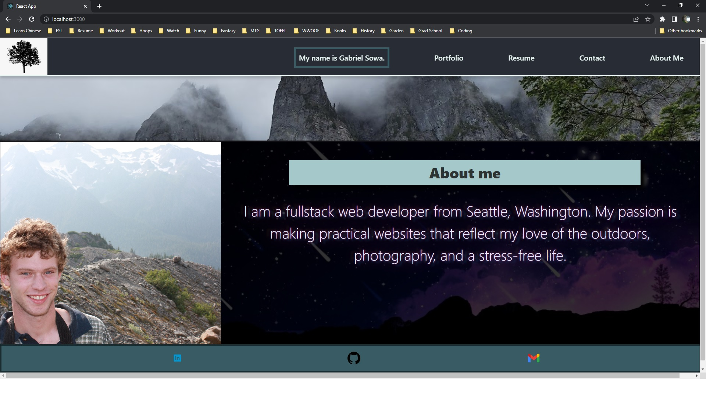
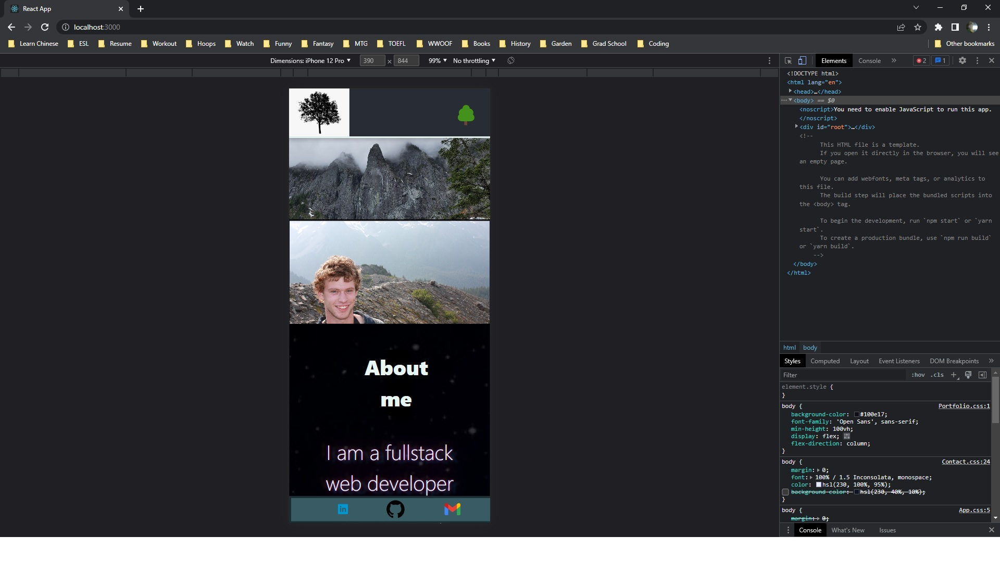
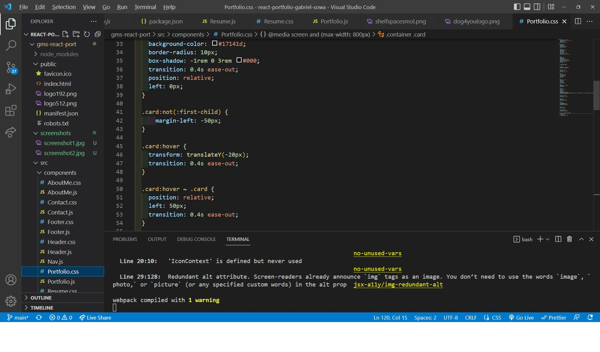
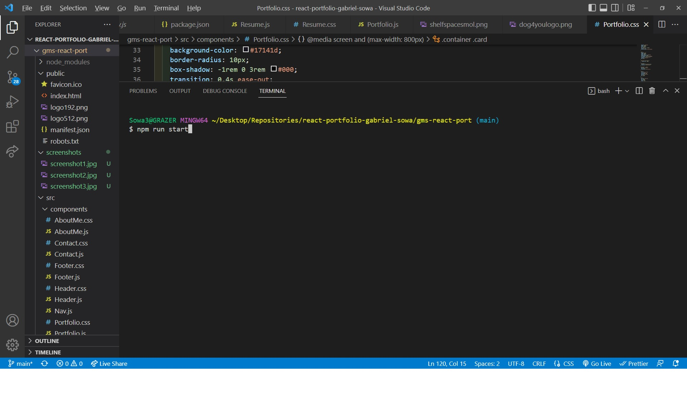
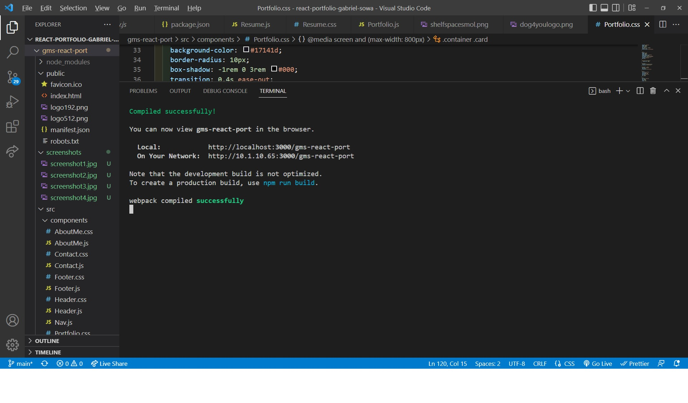

# Gabe-Sowa-React-Portfolio

# Live Deployed Site:

## Table of Contents

-   [Description](#description)
-   [Installation](#installation)
-   [Usage](#Usage)
-   [Bugs](#Bugs)
-   [Screenshots](#screenshots)
-   [Credits](#credits)

## Description

This was a primarily front-end project focused on using newly learned skills in React to create and render a dynamic website. The website of choice was a portfolio/profile website for myself. The mission was rendering multiple components dynamically using state based effects in order to keep the entire project on one page.

-   The motivation behind this project was strong, and two-fold: hone React skills, which are highly relevant in real-world programming jobs today, and try to create a good-looking portfolio page that could be used, with continued work, as a real portfolio for myself in the programming world. Because React is so new to me and so expansive, it was an intimidating project. Few of our projects have required learning what is essentially an entirely new language so quickly. This, however, was also one of the more fun projects we've worked on because React is an exciting tool that allows us to do many of the things we've already learned in a more efficient, sensible manner.
-   I built this project in order to improve relevant real-world coding skills and begin the base of what could be a future resume for myself. This project was also a reintroduction to front-end development after spending a significant amount of time in back-end; I found rather quickly that I was rusty at both CSS and HTML layout and had to refamiliarize myself with the languages, which was a good thing to do.
-   This project does not retain any real utility for others, although my goal is to implement contact functionality that would allow people viewing my page and my work to contact me easily via a form. The primary utility in this project lies in its templating; resume or profile pages are common free-lance work for developers, and knowing how to create a functional (and beautiful one) could potentially be a key skill in finding gainful employment.
-   This was a highly challenging project in that it was large in scope and required a significant amount of forethought in both its layout and function. In fact, I learned a tremendous lesson here about wireframing and design because I found about mid-way into the project that what I had set up was not going to work perfectly in sync with the suggested user story; I could make the portfolio "work," but it taught me that I needed to carefully consider exactly what I needed to do beforehand in order to meet client requirements. React in particular requires planning ahead because components must be carefully grafted onto eachother and propped in to avoid conflict or overlap. Lesson learned.

## Installation

-   This website is deployed to a live heroku page and can be viewed there. The source code can also be run from its root using the command 'npm start,' which should begin the server at localhost:3000.

## Usage

-   This is a simple portfolio website that can be navigated from the header at the top of the page. One can also view my Github, LinkedIn, or send me a private email from their computer's email client by clicking the gmail logo at the bottom of the page.

## Bugs

-   Currently there are several bugs within the program:

-   Some of the pages do not media query properly and stack as they should. I ran out of time trying to make this work but is a top priority to fix in the future.
-   I was not able to complete the form for submitting contact info.
-   Small CSS glitches such as deadspace and improperly placed borders.

## Screenshots

-   
-   
-   
-   
-   

## Credits

-   This project could not have been completed without the hardwork and excellent advice of my educators at UW Fullstack and tutor, Jacob Carver.
